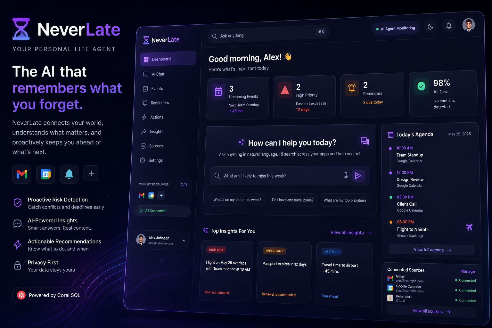
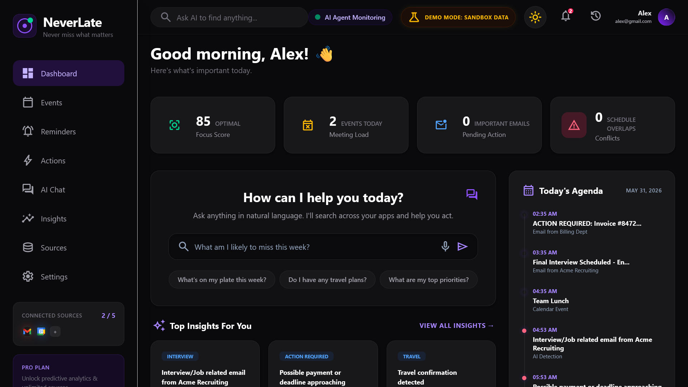
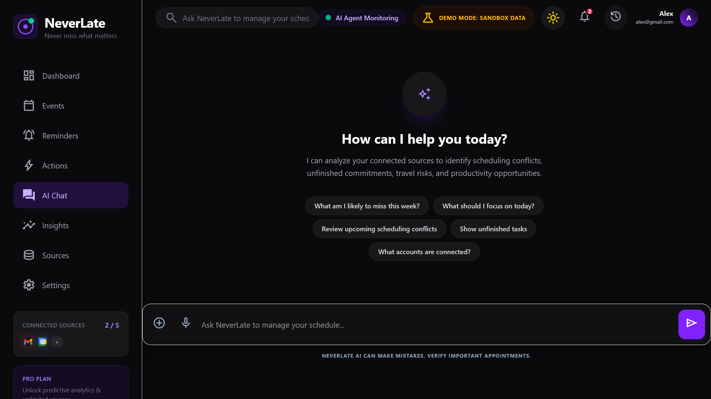
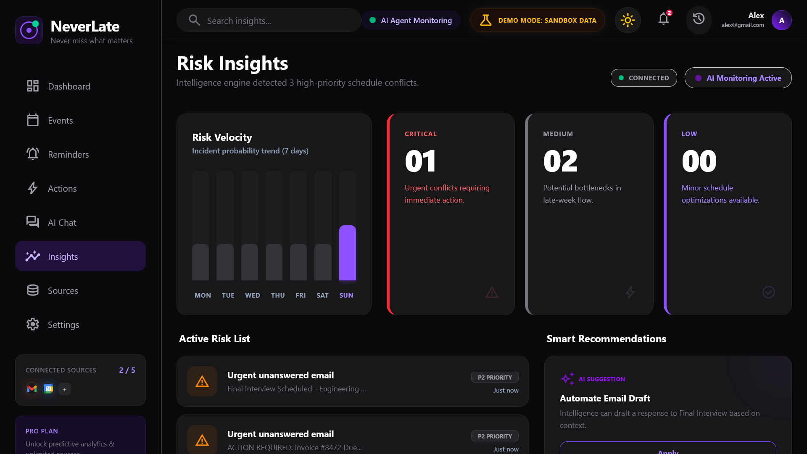

<div align="center">

<br/>

# ⏳ NeverLate

### *"Never miss what matters."*

[](https://withcoral.com/docs)
[]()
[](https://react.dev/)
[](https://www.typescriptlang.org/)
[](https://vitejs.dev/)
[](https://tailwindcss.com/)
[](https://coral.dev/)
[](LICENSE)

> Built for the **WeMakeDevs Coral Hackathon** 🚀

</div>

---

<br/>

<div align="center">
  
</div>

<br/>

## 📖 Overview

**NeverLate** is an AI-powered personal life agent. We built it because modern life is heavily fragmented. Our schedules, communications, and commitments are scattered across disconnected applications. NeverLate functions as a secure, personal AI agent that continuously analyzes connected data sources to proactively surface what matters most.

<p align="left">
  <a href="https://neverlate-web.vercel.app">
    
  </a>
  <a href="https://youtube.com/watch?v=67KmcqO2-70">
    
  </a>
  <!-- <a href="https://devpost.com/software/neverlate">
    
  </a> -->
</p>

## 🎯 The NeverLate Moment

Imagine it's Tuesday morning.

You have:

* a flight on Friday
* a passport renewal email buried in Gmail
* a project deadline tomorrow
* two overlapping calendar meetings
* a hotel confirmation sitting unread

Individually, each tool knows part of the story.

None of them knows the whole story.

NeverLate connects the dots.

Instead of forcing users to search across applications, NeverLate proactively surfaces:

> "Your flight is in 3 days. Your passport renewal is still incomplete. You also have a conflicting meeting during airport transit time."

The goal isn't better reminders.

The goal is preventing problems before they happen.

## 🎬 Demo Scenario

Sarah is traveling to Canada next week.

NeverLate discovers:

- an unread flight confirmation email
- a missing hotel check-in reminder
- a project review meeting scheduled during airport transit
- a passport renewal task still marked incomplete

The AI combines information from multiple sources and proactively surfaces:

> "You have a flight in 4 days, a conflicting meeting during airport transit, and an unfinished passport-related task that may impact travel."

Instead of finding problems after they happen, Sarah resolves them before they become emergencies.

## 🛑 What Problem Are We Solving?

Modern life is fragmented across:
- Gmail
- Google Calendar
- Reminders
- To-do lists
- Travel confirmations
- Notifications
- Personal commitments

People spend far too much time manually tracking commitments, cross-referencing calendars against emails, and frequently missing important events because critical information is siloed in disconnected tools.

## 💡 What We Built

NeverLate is an AI-powered personal life agent that connects fragmented data sources and proactively identifies risks before they become problems.

The system combines:

- AI-powered natural language interaction
- Deterministic risk analysis
- MCP-based tool integrations
- Unified dashboard experiences
- Cross-source contextual reasoning

Instead of helping users search for information, NeverLate helps users discover what requires attention.

## ✨ Key Features

| Feature | Description |
|---------|-------------|
| 💬 **Conversational Life Assistant** | Ask complex questions about your schedule and get immediate, contextual answers. |
| 🛡️ **Commitment Risk Detection** | Automatically flags double-bookings, tight connections, and unread critical emails. |
| 📊 **Unified Life Command Center** | A stunning command center bringing emails, calendars, and AI insights into a single view. |
| 🔌 **Extensible Data Sources** | Built on MCP to effortlessly pull data from Gmail, Google Calendar, and future integrations. |
| 🌑 **Premium Dark UI** | A gorgeous glassmorphism interface built with TailwindCSS v4 and React 19. |

## 🚶 User Experience Walkthrough

1. **Dashboard:** Start your day with a unified overview of active risks, KPIs, and immediate next steps.
2. **AI Chat:** Chat with your personal agent to generate custom briefings or ask about specific travel plans.
3. **Events & Reminders:** Review beautifully categorized timelines of upcoming meetings and urgent reminders.
4. **Insights:** See data-driven analytics regarding your productivity, time saved, and meeting velocity.
5. **Actions:** Actionable items requiring immediate resolution are aggregated securely in one place.

## 📸 Product Experience

### Dashboard

The Dashboard provides a unified view of risks, priorities, upcoming events, and AI-generated recommendations.

<div align="center">
  
</div>

### AI Chat

Ask natural-language questions and receive contextual answers grounded in connected data sources.

<div align="center">
  
</div>

### Insights

Analyze workload trends, productivity signals, and scheduling patterns.

<div align="center">
  
</div>

## 🪸 How We Used Coral

NeverLate uses Coral as the foundation for connecting and querying external data sources.

Coral enables our AI agent to securely access structured information from connected systems and transform that information into actionable insights.

Within NeverLate, Coral is used to:

- Connect external productivity data sources
- Retrieve contextual information for AI reasoning
- Support MCP tool execution
- Provide structured access to user information
- Power the AI agent's understanding of schedules, commitments, and notifications

By combining Coral with MCP, NeverLate can reason across multiple sources rather than treating each application in isolation.

## 🔗 Connected Data Sources

NeverLate is designed around connected productivity ecosystems.

Current integrations include:

| Source | Purpose |
|----------|----------|
| Gmail | Travel confirmations, deadlines, notifications, reminders |
| Google Calendar | Meetings, appointments, scheduling conflicts |
| Coral Sources | Structured retrieval of contextual information |

Future integrations:

- Notion
- Slack
- Jira
- Linear
- Outlook
- Google Tasks

## 🧠 AI Agent Architecture

Our backend orchestration relies on three interconnected intelligence layers:

### 1. AI Engine
The central orchestration layer responsible for routing user requests, selecting the best reasoning strategy, and coordinating tool execution.

### 2. Heuristic Engine
Handles lightning-fast, deterministic reasoning. It powers the real-time prioritization, conflict detection, deadline analysis, and rule-based insights without relying on costly LLM calls for every computation.

### 3. LLM Engine
Handles natural language understanding (NLU), intent classification, and generates human-readable responses based on the data retrieved by the other engines.

## 🛠️ Why MCP?

Most AI assistants are limited to whatever information is manually pasted into a chat window.

NeverLate uses the Model Context Protocol (MCP) to transform external systems into AI-accessible tools.

This means the AI can:

* query Gmail
* inspect upcoming calendar events
* identify scheduling conflicts
* analyze reminders
* retrieve contextual information

without hardcoding every integration into the reasoning layer.

MCP allows NeverLate to scale from a simple productivity assistant into a true personal life agent.

## ⚡ How It Works

1. **Connect Sources**: Connect your Gmail, Google Calendar, and other tools.
2. **Gather Context**: The AI gathers relevant information from your connected sources using MCP tools.
3. **Detect Conflicts**: The Heuristic Engine analyzes the information to detect potential risks and conflicts.
4. **Generate Insights**: The LLM generates insights based on the detected risks and conflicts.
5. **Recommend Actions**: The LLM recommends actions to resolve the detected risks and conflicts.

## 🏗️ System Architecture

```txt
  ┌───────────────┐     ┌───────────────┐     ┌───────────────┐
  │     Gmail     │     │Google Calendar│     │ Future Sources│
  └───────┬───────┘     └───────┬───────┘     └───────┬───────┘
          │                     │                     │
          └──────────────┬──────┴─────────────────────┘
                         ▼
             ┌─────────────────────────┐
             │       MCP Layer         │
             │   (Tool Abstraction)    │
             └───────────┬─────────────┘
                         │
        ┌────────────────▼────────────────┐
        │        NeverLate Backend        │
        │                                 │
        │  ┌─────────┐   ┌─────────────┐  │
        │  │AI Engine│◄─►│Heuristic Eng│  │
        │  └────┬────┘   └─────────────┘  │
        │       │                         │
        │  ┌────▼────┐                    │
        │  │LLM Eng. │                    │
        │  └─────────┘                    │
        └────────────────┬────────────────┘
                         │
          ┌──────────────┴──────────────┐
          ▼                             ▼
  ┌───────────────┐             ┌───────────────┐
  │   Dashboard   │             │    AI Chat    │
  └───────────────┘             └───────────────┘
  ┌───────────────┐             ┌───────────────┐
  │   Insights    │             │    Actions    │
  └───────────────┘             └───────────────┘
```

## 🔄 AI Reasoning Flow

```txt
User Question
      │
      ▼
 AI Intent Router
      │
      ▼
 MCP Tools
      │
      ▼
 Gmail + Calendar
      │
      ▼
 Heuristic Analysis
      │
      ▼
 LLM Response
      │
      ▼
 Actionable Recommendation
```

## 🗂️ Repository Structure

```text
apps/
├── server/                 # Express backend orchestration
│   ├── ai/                 # Core intelligence layer
│   │   ├── aiEngine.ts     # Request routing & strategy
│   │   ├── heuristicEngine.ts # Deterministic rule processing
│   │   └── llmEngine.ts    # Natural language generation
│   ├── coral-sources/      # External data integrations
│   ├── mcp/                # Model Context Protocol
│   │   ├── registry.ts     # Tool registration
│   │   ├── interfaces.ts   # Typings
│   │   └── tools/          # Discrete MCP tools
│   ├── services/           # Business logic & API wrappers
│   └── utils/              # Shared backend utilities
│
├── web/                    # React frontend application
│   ├── components/         # Reusable UI elements
│   ├── pages/              # Application routes
│   ├── context/            # React state context
│   ├── hooks/              # Custom React hooks
│   ├── services/           # API interaction layer
│   └── data/               # Mock & static data assets
│
packages/                   # Shared monorepo packages
├── ai/                     # Shared AI typings & prompts
└── shared/                 # Common interfaces
```

## 🌍 Why This Matters

People don't miss commitments because they lack calendars.

They miss commitments because context is fragmented.

The challenge isn't storing information.

The challenge is connecting information.

NeverLate helps users understand relationships between emails, events, reminders, and commitments so they can act before problems occur.

## 💻 Tech Stack

**Frontend Stack:**
- React
- TypeScript
- Vite
- Tailwind CSS

**Backend Stack:**
- Node.js
- Express
- TypeScript

**AI & Orchestration:**
- Model Context Protocol (MCP)
- Custom Heuristic & LLM Engines

## 🚀 Demo, Repository & Setup

### Live Demo

[Launch NeverLate](https://neverlate-web.vercel.app)

### Demo Video

[Watch Demo](https://youtu.be/67KmcqO2-70)

### Repository

https://github.com/GPramodh07/NeverLate

### Quick Start

```bash
npm install
npm run dev
```

### Environment Variables
Create a `.env` file in the root directory and configure the necessary parameters.

```env
# Backend Configuration
PORT=3000

# Coral Configuration
CORAL_BASE_URL=http://localhost:8080

# Demo Mode Configuration
# Bypasses Coral execution and returns mock data for testing (use false to enable real data)
MOCK_MODE=true

# Frontend Configuration
VITE_API_URL=http://localhost:3000

# Exposes the flag to the React frontend to display the "Demo Mode" UI badge. (use false to hide it)
VITE_MOCK_MODE=true
```

### Configuring Coral Sources

See: `docs/coral-source-setup.md`

### Running Locally

```bash
# 1. Clone the repository
git clone https://github.com/your-org/neverlate.git
cd neverlate

# 2. Install monorepo dependencies
npm install

# 3. Start the development server (runs frontend and backend concurrently)
npm run dev
```

## ☁️ Deployment Architecture

NeverLate is deployed as a modern monorepo with the React frontend hosted on Vercel and the Express AI backend hosted on Render.

```txt
         ┌──────────────────┐
         │     USER UI      │
         └────────┬─────────┘
                  │
      ┌───────────▼───────────┐
      │        VERCEL         │
      │ (React Frontend App)  │
      └───────────┬───────────┘
                  │
      ┌───────────▼───────────┐
      │        RENDER         │
      │ (Node.js/Express API) │
      └───────────┬───────────┘
                  │
      ┌───────────▼───────────┐
      │  CONNECTED SOURCES    │
      │   (Gmail, Calendar)   │
      └───────────────────────┘
```
*Note: Shared packages are securely orchestrated via a monorepo workspace during the build step.*

## 🤖 AI-Assisted Development

Our team leveraged cutting-edge AI tools including **ChatGPT**, **Gemini**, and **Antigravity** to accelerate development during the hackathon. We utilized these tools for:

- Architecture exploration
- Implementation acceleration
- Rapid debugging
- Code review assistance
- Documentation generation

**Transparency Note:** Humans made all final technical decisions, manually validated every implementation, and governed the system architecture. AI was used as a powerful accelerator, but it did not replace our core engineering judgment.

## 🔮 What's Next?

### More Integrations

- Notion
- Slack
- Linear
- Jira
- Outlook

### Agentic Actions

- Draft emails
- Reschedule meetings
- Create reminders
- Trigger workflows

### Smarter Predictions

- Travel risk forecasting
- Deadline risk scoring
- Commitment overload detection

### Real-Time Experiences

- Push notifications
- Mobile applications
- Live synchronization

## 👥 Contributors

<table>
  <tr>
    <td align="center">
      <a href="https://github.com/oluwatobiss">
        <br/>
        <sub><b>Oluwatobi Sofela</b></sub>
      </a>
    </td>
    <td align="center">
      <a href="https://github.com/GPramodh07">
        <br/>
        <sub><b>G Pramodh</b></sub>
      </a>
    </td>
    <td align="center">
      <a href="https://github.com/ShazilParwez">
        <br/>
        <sub><b>Shazil Parwez</b></sub>
      </a>
    </td>
  </tr>
</table>

## 📄 License

This project is licensed under the MIT License - see the [LICENSE](LICENSE) file for details.

---

<div align="center">

*Built with ❤️ for the **WeMakeDevs Coral Hackathon***

**Connect your digital life. Detect conflicts before they happen. Never miss what matters.**

</div>